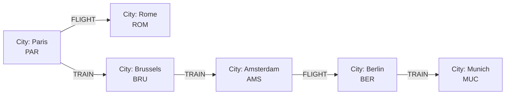
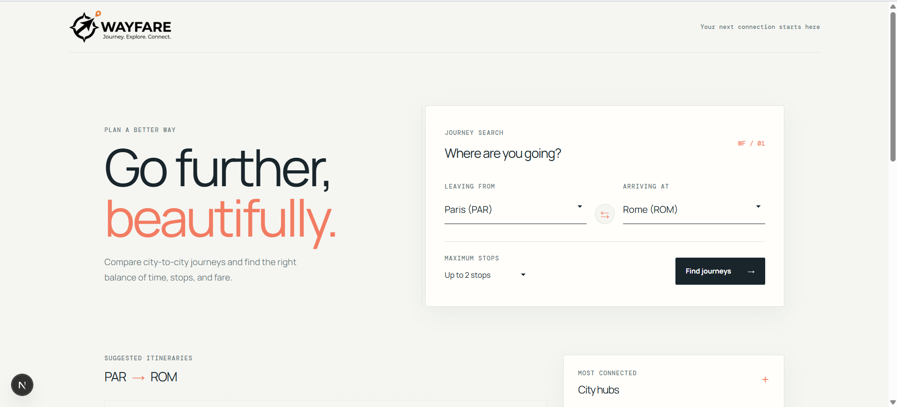
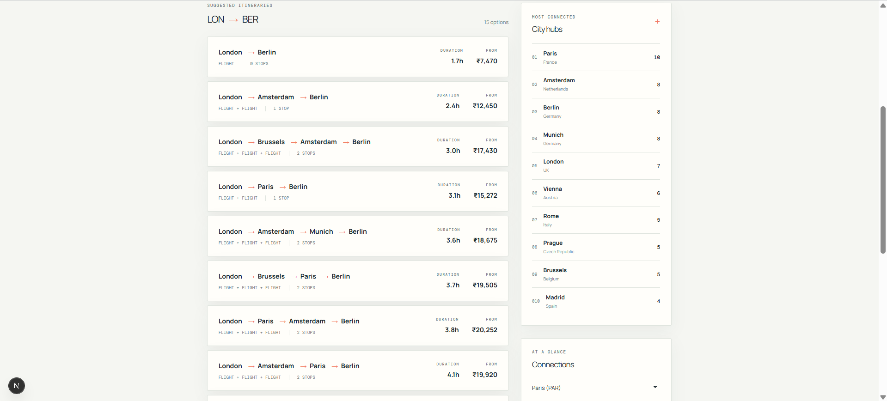
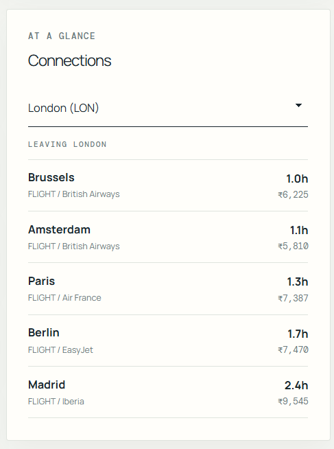

# Wayfare - Travel Itinerary Graph Explorer

Wayfare helps travelers compare city-to-city journeys by duration, stops, transport mode, and fare. Search across a network of European cities, inspect suggested itineraries, and explore the most connected hubs.

## Demo

- **Hosted application:** [travel-itinerary-graph.vercel.app](https://travel-itinerary-graph.vercel.app/)
- **Short screen recording:** [Watch the Wayfare walkthrough](https://drive.google.com/file/d/1dFwzEooSKYYMuY32gVVTELhLcmkCSE15/view?usp=sharing)

Replace both values before publishing the repository. The application can be deployed on any free hosting tier that supports a Next.js application, such as Vercel.

## Why A Graph Database?

Travel planning is a connections problem. Cities are naturally represented as nodes, while flights and trains are relationships between them. A graph database makes multi-city route discovery direct and expressive:

- Find paths across one to four travel legs with one traversal.
- Calculate total duration and fare while traversing each relationship.
- Rank the most connected cities with a simple relationship count.
- Add airports, airlines, schedules, hotels, or availability without redesigning a collection of join tables.

The route search uses directed, bounded, simple paths. This matches the bidirectional relationships loaded by the seed script while preventing reverse duplicates and cyclic itineraries.

## Data Model



### Nodes

```text
(:City {
  name: String,
  country: String,
  code: String,
  lat: Float,
  lng: Float
})
```

### Relationships

```text
(:City)-[:FLIGHT {
  duration_hours: Float,
  price_usd: Float,
  airline: String,
  distance_km: Integer
}]->(:City)

(:City)-[:TRAIN {
  duration_hours: Float,
  price_usd: Float,
  distance_km: Integer
}]->(:City)
```

The sample dataset contains 12 European cities. The seed data creates 27 flight pairs and 9 valid train pairs in both directions, for 72 relationships total. The Rome-to-Milan train is skipped because Milan is not part of the sample city list.

## Features

- Search itineraries between any two available cities.
- Limit results by the maximum number of stops.
- Sort suggested journeys by total duration.
- Compare total journey fares and direct connection fares in INR.
- Explore the most connected city hubs.
- Inspect direct flights and trains leaving from any city.
- Responsive ticket-inspired interface with loading, empty, and error states.
- Parameterized Cypher values and environment-based database configuration.
- Graceful API responses when the database is unavailable.

## Tech Stack

- **Application:** Next.js 16 App Router and JavaScript
- **Database:** CognoDB using the openCypher and Bolt protocols
- **Driver:** Official `neo4j-driver` package
- **Styling:** CSS with Tailwind CSS import support
- **Deployment:** Vercel or another free Node-compatible hosting tier

## Setup

### Prerequisites

- Node.js 20 or newer
- npm
- A CognoDB instance and its Bolt connection details

### 1. Create a CognoDB instance

1. Open the [CognoDB console](https://console.cognodb.com/signup).
2. Create a free `c0` instance.
3. Copy the instance `bolt+s://` URI.
4. Copy the password for the `cognodb` user.

Keep the password private and never commit an environment file.

### 2. Install the application

```bash
git clone https://github.com/<your-username>/travel-itinerary-graph.git
cd travel-itinerary-graph
npm install
```

### 3. Configure environment variables

Create `.env.local` in the project root:

```env
NEO4J_URI=bolt+s://<your-instance-id>.databases.cognodb.cloud
NEO4J_USERNAME=cognodb
NEO4J_PASSWORD=your-password-here
```

For this repository, the local seed command also supports `src/scripts/.env.local`. Root `.env.local` is recommended for normal development and deployment.

### 4. Load the sample graph

Run the seed script from the repository root:

```bash
node src/scripts/seed.js
```

The script clears existing graph data, creates the 12 sample cities, loads flights and trains in both directions, and prints verification counts.

### 5. Run locally

```bash
npm run dev
```

Open [http://localhost:3000](http://localhost:3000).

### 6. Validate the project

```bash
npm run lint
npm run build
```

## API Routes

| Endpoint | Purpose |
| --- | --- |
| `GET /api/cities` | Returns all cities ordered by name. |
| `GET /api/hubs` | Returns the ten cities with the most outgoing connections. |
| `GET /api/search?code=PAR` | Returns direct connections from a city. |
| `GET /api/routes?from=PAR&to=ROM&maxStops=2` | Returns up to 15 duration-sorted itineraries. |

Route search accepts city codes case-insensitively. `maxStops` is clamped between 0 and 5; the default is 2. API fare fields use the seeded `price_usd` property, while the interface displays INR using the application conversion rate.

## Main Cypher Queries

### 1. Multi-city route search

The route endpoint inserts the validated hop limit into a fixed bounded relationship pattern. It then filters out paths that revisit a city, calculates totals, and orders by duration:

```cypher
MATCH path = (start:City {code: $from})-[*1..${maxHops}]->(end:City {code: $to})
WHERE ALL(node IN nodes(path) WHERE single(other IN nodes(path) WHERE other = node))
WITH path,
     [r IN relationships(path) | type(r)] AS modes,
     reduce(totalTime = 0.0, r IN relationships(path) |
       totalTime + r.duration_hours) AS totalDuration,
     reduce(totalPrice = 0.0, r IN relationships(path) |
       totalPrice + r.price_usd) AS totalPrice,
     [n IN nodes(path) | n.name] AS cityNames
RETURN cityNames, modes, totalDuration, totalPrice,
       length(path) AS stops
ORDER BY totalDuration ASC
LIMIT 15
```

`$from` and `$to` are parameterized driver values. `maxHops` is validated server-side and limited to six relationship hops, so the query remains bounded.

### 2. Most connected hubs

```cypher
MATCH (c:City)-[r]->()
RETURN c.name AS city,
       c.code AS code,
       c.country AS country,
       count(r) AS connections
ORDER BY connections DESC
LIMIT 10
```

This counts outgoing relationships and provides the ranked hub list shown in the interface.

### 3. Direct connections

```cypher
MATCH (c:City {code: $code})-[r]->(other:City)
RETURN other.name AS city,
       other.code AS code,
       other.country AS country,
       type(r) AS mode,
       r.duration_hours AS duration,
       r.price_usd AS price,
       r.airline AS airline
ORDER BY r.duration_hours ASC
```

The `$code` value is passed through the Neo4j driver, and the result is used by the direct-connections panel.

### 4. Seed verification

```cypher
MATCH (c:City)
RETURN count(c) AS cities

MATCH ()-[r]->()
RETURN count(r) AS relationships
```

## Project Structure

```text
.
├── public/
│   ├── Wayfare logo.png
│   ├── screen-1.png
│   ├── screen-2.png
│   └── screen-3.png
├── src/
│   ├── app/
│   │   ├── api/
│   │   │   ├── cities/route.js
│   │   │   ├── hubs/route.js
│   │   │   ├── routes/route.js
│   │   │   └── search/route.js
│   │   ├── globals.css
│   │   ├── layout.js
│   │   └── page.js
│   ├── lib/neo4j.js
│   └── scripts/seed.js
├── .env.example
├── next.config.mjs
├── package.json
└── README.md
```

## Screenshots

### Home and Journey Search



### Suggested Itineraries



### City Hubs and Connections



## Deployment

### Vercel

1. Import the repository into [Vercel](https://vercel.com/).
2. Keep the build command as `npm run build`.
3. Add `NEO4J_URI`, `NEO4J_USERNAME`, and `NEO4J_PASSWORD` under Project Settings > Environment Variables.
4. Deploy and add the resulting URL to the **Demo** section above.

The database must be reachable from the hosting provider. Do not commit `.env.local` or expose database credentials in client-side code.

## Recording Checklist

Record a short walkthrough that shows:

1. The Wayfare home screen.
2. Selecting departure and arrival cities.
3. Searching for a journey.
4. Comparing duration, stops, transport mode, and INR fare.
5. Opening the city connections panel.

Add the uploaded recording URL to the **Short screen recording** field in this README.
